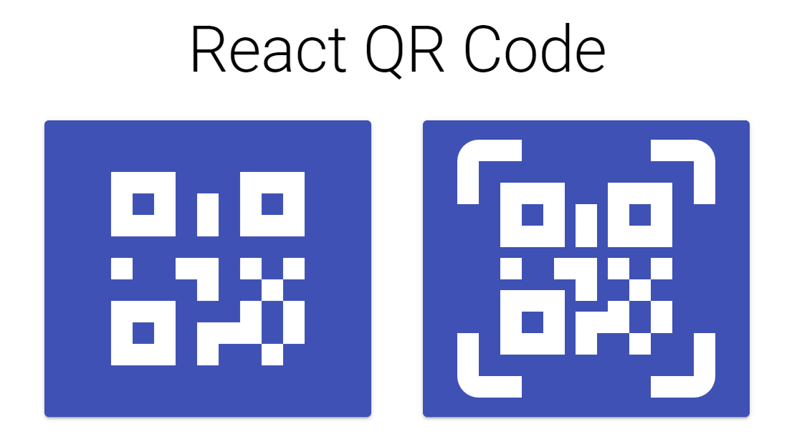

# 관리자용 QR Code Scanner

접수 및 대기인원 파악을 위해 사용되는 관리자용 QR Scanner. 


- __React UI Kit: [Material UI](https://material-ui.com/)__

    Install Material UI core:
    ```bash
    $ npm i @material-ui/core @material-ui/icons
    ```

- __Icons: [Material Design Icons](https://materialdesignicons.com/)__

    Install Material Design Icons:
    ```bash
    $ npm i @mdi/react @mdi/js @mdi/font
    ```

    Add these lines on `./public/index.html` head:
    ```html
    <!-- Roboto fonts -->
    <link rel="stylesheet" href="https://fonts.googleapis.com/css?family=Roboto:300,400,500,700&display=swap" />
    <!-- Material Icons fonts -->
    <link rel="stylesheet" href="https://fonts.googleapis.com/icon?family=Material+Icons" />
    ```

- __QR Generator: [qrcode.react](https://www.npmjs.com/package/qrcode.react)__

    Install `qrcode.react`:
    ```bash
    $ npm i qrcode.react
    ```

- __QR Scanner: [react-qr-reader](https://www.npmjs.com/package/react-qr-reader)__

    Install `react-qr-reader`:
    ```bash
    $ npm i react-qr-reader
    ```


### Preview

- Home Page




- QR Scanner Page


- QR Scanned Page


### API

__PATCH: /paper/qr-usage-count__


- 1회 스캔 시 waitings +1 update
- 2회 스캔 시 waitings -1 update
